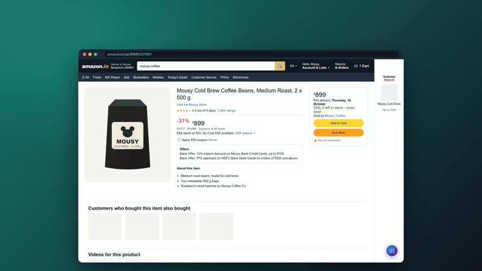
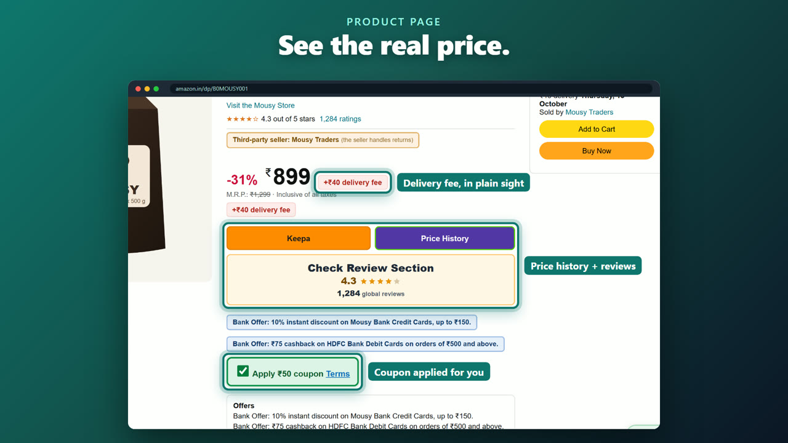
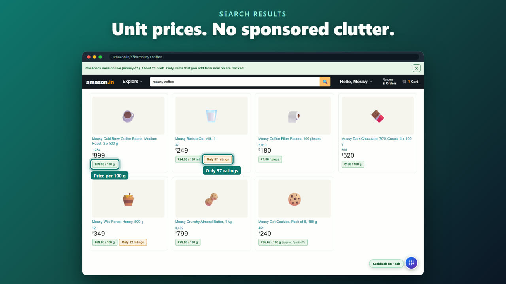
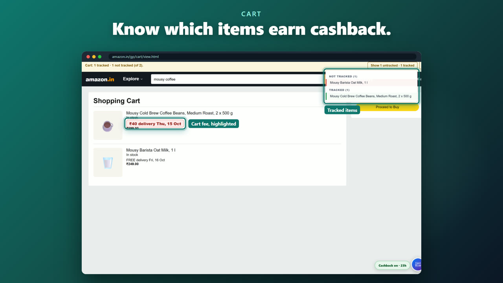
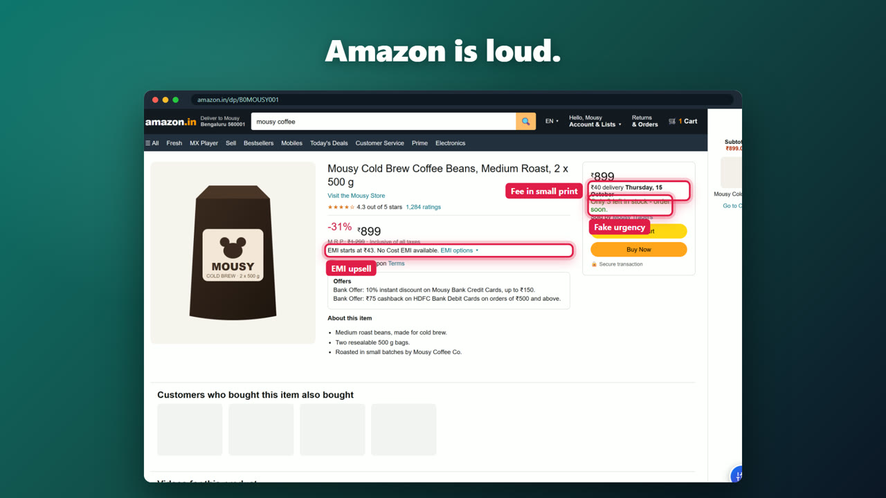
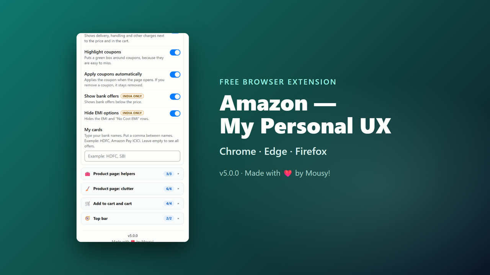

# Amazon — My Personal UX

**A calm, honest Amazon.** This browser extension removes clutter from Amazon pages.
It shows the fees that Amazon puts in small print. It also adds useful helpers, for
example the price for each 100 g and a link to the price history.

Version 5.0.0 · Chrome · Edge · Firefox · amazon.in and amazon.com

[](docs/media/promo.mp4)

*Click the preview to watch the video with sound.*

---

## What it does

### On a product page



- Shows extra fees, for example delivery, next to the price.
- Applies coupons for you, and puts a green box around them.
- Adds buttons for price history (Keepa and PriceHistory) and for reviews.
- Tells you when a third-party seller sells the item.
- Removes "Only 3 left" urgency text, video rails and brand rails.

### In search results



- Removes sponsored results.
- Shows the price for each 100 g, 100 ml or piece, so you can compare sizes.
- Warns you when a product has fewer than 50 ratings.

### In the cart



- Makes delivery charges large and red, so you see them.
- Shows which items earn cashback from a cashback link (for example CashKaro).

### Before and after



This is the same page when the extension is set to **Disabled**.

---

## Settings



All settings are in one list. The list has six groups. Each group is one part of Amazon:

| Group | What it changes |
|---|---|
| 🔍 Search results | Sponsored results, unit prices, few ratings |
| 🏷️ Product page: price and offers | Price size, fees, coupons, bank offers, EMI |
| 🧰 Product page: helpers | Seller badge, price history, reviews |
| 🧹 Product page: clutter | Urgency text, rails, videos, feedback block, section order |
| 🛒 Add to cart and cart | Subscribe & Save, protection plans, cart side panel, cashback |
| 🧭 Top bar | Account menu, Explore menu |

You can open the settings in two places:

- Click the extension icon in the browser toolbar.
- On an Amazon page, click the round button at the bottom-right, or push **Alt+A**.

There are two modes:

- **Simple** — the extension works. It uses the switches on the Settings tab.
- **Disabled** — you see the normal Amazon page. The extension changes nothing.

A change applies immediately. You do not have to reload the page. Your browser keeps
your settings in your browser profile, so they follow you to your other computers.

Some settings are for amazon.in only (for example bank offers). On amazon.com these
settings show "India only" and you cannot change them.

---

## Install

The extension is not in a store yet. Install it from this folder.

### Chrome

1. Open `chrome://extensions`.
2. Turn on **Developer mode** (top-right).
3. Click **Load unpacked**.
4. Select this folder (the folder that has `manifest.json` in it).

### Edge

1. Open `edge://extensions`.
2. Turn on **Developer mode** (left side).
3. Click **Load unpacked**.
4. Select this folder.

### Firefox

1. Open `about:debugging#/runtime/this-firefox`.
2. Click **Load Temporary Add-on…**.
3. Select the `manifest.json` file in this folder.

Firefox removes a temporary add-on when you close Firefox. For a permanent install,
Mozilla must sign the extension. The steps are in [docs/release.md](docs/release.md).

---

## Privacy

- The extension works only on `www.amazon.in` and `www.amazon.com`.
- It does not work on the sign-in pages or the checkout pages.
- It does not send data to a server. It has no analytics.
- The only permission is `storage`. The extension uses it to keep your settings.
- The price history buttons open Keepa or PriceHistory only when you click them.

---

## For developers

- [AGENTS.md](AGENTS.md) — the rules and a map of the code, for people and AI agents.
- [CHANGELOG.md](CHANGELOG.md) — what changed in each version.
- [docs/](docs/) — architecture, the settings list, tests and release steps.

Quick commands:

```powershell
python -m pytest tests -q        # Run the tests (Playwright, Chromium)
python tools/build.py            # Make the Chrome, Edge and Firefox zips in dist/
npx web-ext lint --source-dir dist/firefox  # Check the Firefox rules (after the build)
```

## License

[GPL-3.0](LICENSE). You can use, change and share this code. If you share a changed version, it must also be GPL-3.0 and include its source code.

---

Made with ❤️ by Mousy!
