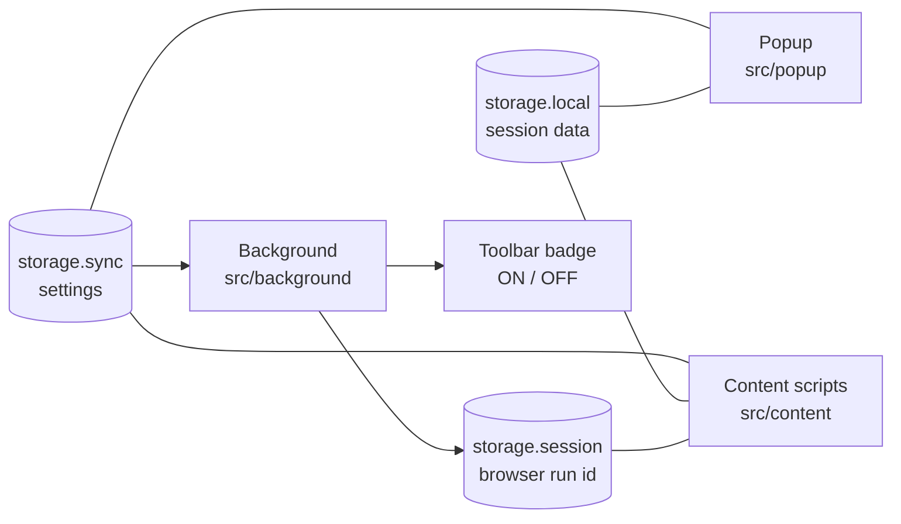

# Architecture

## 1. The four parts



| Part | Files | What it does |
|---|---|---|
| Shared settings | `src/shared/settings.js` | The list of settings, the defaults, and the builders for the settings screen. The popup and the page panel both use it, so they always agree. |
| Content scripts | `src/content/*.js`, `content.css` | Run on Amazon pages. They change the page. |
| Popup | `src/popup/*` | The window that opens from the toolbar icon. |
| Background | `src/background/background.js` | Sets the badge (ON / OFF). Opens `storage.session` to the content scripts. |

The parts do not send messages to each other. They talk only through storage:
a part writes a value, and the other parts get a `storage.onChanged` event.

## 2. Storage

| Area | Key | What it keeps |
|---|---|---|
| `sync` | `settings` | `mode` (`simple` or `off`), one boolean for each switch, `myCards` (text) |
| `local` | `affTag`, `affAt`, `affRun` | The cashback tag, when it started, and the browser run id at that time |
| `local` | `trackedAsins` | The items added to the cart while a cashback tag was live |
| `local` | `cashbackHidden`, `ewcOpen`, `uiCollapsed` | UI state: banner closed, cart panel open, groups folded |
| `local` | `wishlists`, `wishlistsAt` | Wishlist names, kept for 15 minutes |
| `local` | `lastHost` | The last Amazon domain. The popup uses it to know the region. |
| `session` | `azRunId` | A random id. The browser deletes it when it closes. |

`AZ.readSettings()` keeps a stored value only if its type is the same as the default.
Thus, bad or old data cannot break the extension.

## 3. Content script start-up

The files load in the order in `manifest.json`:

1. `src/shared/settings.js` — `ext`, `AZ`
2. `core.js` — helpers, `settings`, `session`, `FEATURES`, `defineFeature`
3. `search.js`, `product.js`, `cart.js`, `cashback.js`, `navbar.js` — the features
4. `panel.js` — the in-page settings panel
5. `main.js` — start-up and the run loop

All files share one global scope. See "One shared scope" in `AGENTS.md`.

`main.js` does these steps:

1. Read `sync`, `local` and the browser run id at the same time.
2. Change an old `power` mode to `simple`.
3. Set `data-az="simple"` or `data-az="off"` on `<html>`. The CSS uses it.
4. When the page is ready: build the panel, add one click listener for Add to Cart,
   run all features, and start the `MutationObserver`.

## 4. Features

A feature is one object in `FEATURES`:

```js
defineFeature({
    name: 'search results',          // Shown in the console when it fails
    keys: ['showUnitPrice', 'flagFewReviews'],  // Settings that it uses
    run() { /* Change the page. Safe to call many times. */ },
    reset() { /* Remove all changes that run() made. */ },
});
```

- **Run loop.** Amazon changes the page many times while it loads. The observer calls
  `scheduleRun()`, which runs all features at most one time in 200 ms.
- **Own changes.** `onlyOwnChanges()` ignores changes in the extension's own nodes.
  Without it, each run starts a new run (version 3.7.0 had this loop on product pages).
- **Claims.** `claim(node, tag)` marks a node as done for one feature. `releaseClaims(tag)`
  removes the marks, so `run()` can do the work again after a reset.
- **A setting changes.** `main.js` calls `reset()` on each feature that has the key, then
  runs all features again.
- **Disabled mode.** `cleanupAll()` calls every `reset()`, removes all chips and flags,
  and releases all claims. The page is then the normal Amazon page.
- **Errors.** `safely()` catches an error in one feature, so the other features still run.

## 5. Cross-browser notes

| Topic | Chrome / Edge | Firefox |
|---|---|---|
| API object | `chrome` (Chrome 148+ also has `browser`) | `browser` |
| Callbacks | Allowed, but not used | Not allowed |
| Background | `service_worker` | `scripts` (Firefox 121+) |
| `storage.session` in content scripts | After `setAccessLevel` | After `setAccessLevel`. If it fails, restart detection is off. |
| Wishlist fetch | `fetch` | `content.fetch` (sends the request as the page) |

`manifest.json` has both background keys. Each browser uses the key that it knows.
`tools/build.py` removes the unused key from each store package.

## 6. Security choices

- No `innerHTML`. All text goes in with `textContent`.
- Wishlist links must be on the same Amazon domain and match `/hz/wishlist/ls/<ID>`.
  Thus, a `javascript:` link from the page cannot get into the menu.
- A cashback tag must match `^[\w.-]{1,64}$`.
- The extension does not run on sign-in (`/ap/`, `/ax/`) or checkout (`/gp/buy/`,
  `/checkout/`) pages.
- Alt+A uses `event.code`, so it works on all keyboard layouts and does not fire with AltGr.
